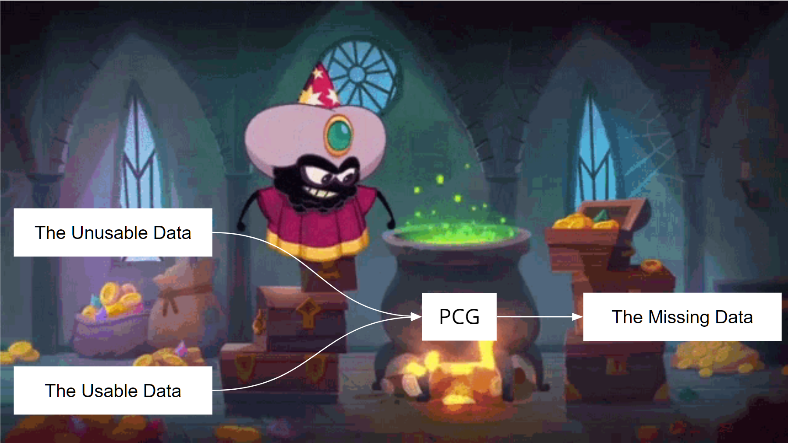

# Adversarial Jaywalker for Autonomous Vehicle Systems

This reseach focuses on realistic adversarial pedestrian behavior modeling for simulation and testing of autonomous vehicles in simulated environment. The methods are implemented in Carla. The project includes the following tasks:

1. Analyzing a diverse set of datasets, including images, videos, and trajectories, and identifying behavioral patterns by exploratory data analysis, clustering, machine learning, and constraints-based systems. 
2. Prototyping generative behavior models using procedural generation, variational autoencoders, GANs, and transformers.
3. Augmenting trajectory datasets.
4. Identifying behaviorally interesting events by analyzing annotations in natural language. 
5. Utilizing adversarial techniques to identify failed cases efficiently.
6. Creating a rich set of behaviors with compositional abilities, including accidental factors not covered by current models.
7. Discovering both high-level decision behaviors and low-level microscopic motions and maneuvers.
8. OpenAi Gymnasium environments for RL-based research

Currently writing a paper a novel hybrid modeling approach to generatively model pedestrian behavior which can make use of both social-force-based models and machine learning-based models to compensate for each other’s limitations. Social-force-based models are highly interactive and adaptive to unseen situations, and ML-based models can capture high variance. Together, they can effectively produce rich generative behavioral models robust to unseen situations. Please cite our papers which is relevant to your research:

```
@inproceedings{inproceedings,
author = {Muktadir, Golam Md and Whitehead, Jim},
journal={2024 IEEE International Conference on Robotics and Automation (ICRA)},
year = {2024},
month = {05},
pages = {},
title = {Adaptive Pedestrian Agent Modeling for Scenario-based Testing of Autonomous Vehicles through Behavior Retargeting}
}

@article{Muktadir2022AdversarialJM,
  title={Adversarial jaywalker modeling for simulation-based testing of Autonomous Vehicle Systems},
  author={Golam Md Muktadir and E. James Whitehead},
  journal={2022 IEEE Intelligent Vehicles Symposium (IV)},
  year={2022},
  pages={1697-1702},
}
```

# Motivation
Our motivation for this work is we have usable data that can be used to train machine learning models, we also have un-usable data that cannot directly be used. So, we innovate new methods to create hybrid models that can benefit from different types of data.



# Howtos
The pedestrian agent is a highly modular system facilitating both machine learning and rule-based methods to be applied in the simulation. Here is the architecture of the simplest planner:


Please refer to our documentation folder for details:

1. [How to use](./docs/How-to-use.md)
2. [Pedestrian Configuration](./docs/pedestrian-configuration.md)
3. [OpenAI Gynasium based Environment](./docs/gym-env.md)
4. [Custom Map with RoadRunner](./docs/create-map.md)

## Research 
This repository contains multiple research methods for jaywalker behavior modeling. Please, read the documentation for more information.
1. [Microscopic Behavior Models](./docs/microscopic-behavior-models.md) - Core micro-scopic behavior models for jaywalker which are used in rest of the models.
2. [CrossWalk Area Modeling](./docs/cross-walk-area-model.md) - Generative pedestrian model covering effective cross-walk area extracted from real-world trajectories.
2. [Soft Trajectory Modeling](./docs/soft-model.md) - Generative pedestrian model that can combine a planning-based approach with microscopic behavior models. Address the issues with retargeting plans from machine learning based models to out-of-distribution scenarios.

# Installation -


Step 1: create a conda environment named "carla37" with python version 3.7.9 and activate it
```
conda create -n carla37 python=3.7.9
conda activate carla37
```

Step 2: clone this repo to your machine and navigate to the root folder in terminal


## windows
Step 3: Update the environment with all the necessary packages needed for this repository
```
conda env update -n carla37 --file environment.yml
```
Now you can run the experiments

## Ubuntu
Step 3: Update the environment with all the necessary packages needed for this repository
```
conda env update -n carla37 --file environment-ubuntu-mac.yml
```
Now you can run the experiments. If you run into issues while installing packages from the previous command. Try installing with the following commands.

```
pip install carla
conda install numpy
conda install matplotlib

conda install -c anaconda click
conda install -c anaconda eventlet
conda install -c intel networkx
conda install -c conda-forge pandas
conda install -c cctbx202008 pyyaml
conda install -c cctbx202112 scipy
conda install -c conda-forge shapely
conda install -c anaconda seaborn
pip install pygame==1.9.6

conda install -c conda-forge gym
```


# Running experiments

There are three ways experiments can be run, based on scenarios, and based on the research settings. Research settings are more useful for pedestrian behavior modeling and the scenarios are useful for ego vehicle modeling. Leaderboard scenarios are for evaluation. All experiments are in the scripts folder. Navigate to *scripts" folder and run the following commands.

```
python r1v1-default.py --max_ticks=500
```

## Running Scenarios

    python scenario_runner2.py --scenario Scenario1v1_1 --configFile ./research/Scenario1v1.xml --reloadWorld
    python scenario_runner2.py --route ./srunner/data/routes_devtest.xml ./srunner/data/all_towns_traffic_scenarios.json 0  (open python manual_control.py in another terminal with the same env)
    python scenario_runner2.py --route ./srunner/data/routes_devtest.xml ./srunner/data/all_towns_traffic_scenarios.json 0 --agent ./leaderboard/autoagents/human_agent.py 
    python scenario_runner2.py --route ./srunner/data/routes_devtest.xml ./srunner/data/all_towns_traffic_scenarios.json 0 --output --json --outputDir ./logs
    python scenario_runner2.py --route ./research/scenario_routes_short.xml ./research/scenario_locations.json 0 --debug

## Running Leaderboard Scenarios
    python leaderboard_evaluator.py --routes ./srunner/data/routes_devtest.xml -a ./leaderboard/autoagents/human_agent.py --route-id=1 --scenarios ./leaderboard/routes/atown2_3scenarios.json
    python leaderboard_evaluator2.py --routes ./research/scenario_routes_short.xml -a ./leaderboard/autoagents/human_agent.py --route-id=0 --scenarios ./research/scenario_locations.json

## Running PSI Soft Model

    cd scripts
    python r1v1vl.py --scenario psi-0002
    python r4v4vl.py --scenario psi-0002
    python rNv1vl.py --scenario psi-0048


## Running Hybrid Procedural Model

## Streaming
You can use the streamer.py file to stream from the spectator in a remote server. Issue this command in the terminal:
```
python streamer.py
```
It will prompt for ip and port.

## Running carla examples
Navigate to the carla examples folder from your carla installation folder. Run any experiment. The streamer should be able to show the simulation.
